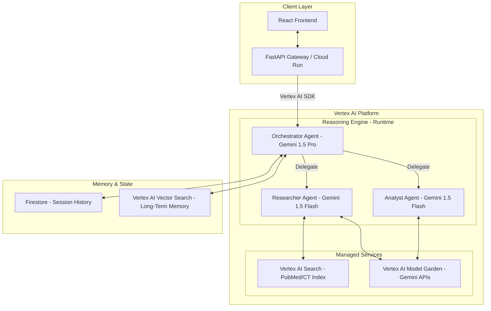

# Treg Research Assistant - Google ADK & Vertex AI Design

## 1. System Overview
The system is a **Multi-Agent System (MAS)** built using **Google Agent Development Kit (ADK)** patterns and deployed on **Google Vertex AI Platform**.

It leverages **Vertex AI Reasoning Engine** for the agent runtime and **Gemini 1.5 Pro/Flash** for intelligence.

## 2. Architecture Diagram

## 3. Component Mapping (ADK & Vertex AI)

### A. Multi-Agent System (ADK Pattern)
-   **Framework**: Python (using `google-cloud-aiplatform` and ADK best practices).
-   **Orchestrator**:
    -   Implemented as a **Reasoning Engine** application.
    -   Uses **Gemini 1.5 Pro** for planning and delegation.
-   **Sub-Agents**:
    -   **Researcher**: Specialized in information retrieval using Vertex AI Search.
    -   **Analyst**: Specialized in data processing using **Vertex AI Code Interpreter** (if available) or local Python sandbox.

### B. Tools (Vertex AI)
-   **Knowledge Retrieval**:
    -   Instead of a local ChromaDB, we use **Vertex AI Search** (Agent Builder) to index PubMed/ClinicalTrials data.
    -   *Benefit*: Managed, scalable, and semantic search out-of-the-box.
-   **Google Search**:
    -   Use **Vertex AI Grounding** with Google Search.
-   **Code Execution**:
    -   Use **Gemini's Code Execution** capability (built-in tool).

### C. Sessions & Memory (ADK)
-   **Session State**:
    -   Stored in **Google Firestore** (NoSQL), following ADK's "Session" schema.
-   **Long-Term Memory**:
    -   **Vertex AI Vector Search** for storing user preferences and past successful experiments.

### D. Observability (Vertex AI)
-   **Tracing**: **Vertex AI TensorBoard** or **Cloud Trace** for agent steps.
-   **Evaluation**: **Vertex AI Evaluation Service** (AutoSxS) to compare agent answers against a golden set.

### E. Deployment
-   **Runtime**: **Vertex AI Reasoning Engine**.
    -   Allows deploying the Python agent code as a managed service.
-   **Frontend**: Deployed on **Google Cloud Run**.

## 4. Implementation Steps (Revised)
1.  **Setup**: Enable Vertex AI, Firestore, and Cloud Run APIs.
2.  **Data**: Upload PubMed/CT JSON to **Vertex AI Search** datastore.
3.  **Agent**:
    -   Define `Orchestrator` class using Vertex AI SDK.
    -   Register tools (Search, Code).
    -   Deploy to Reasoning Engine.
4.  **Frontend**: Update React app to call the Reasoning Engine endpoint (via a lightweight proxy if needed).
