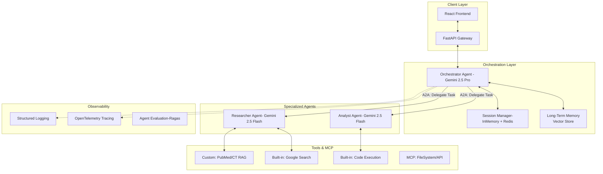

# Treg Research Assistant - Advanced Multi-Agent Design

## 1. System Overview

The system evolves from a simple RAG agent to a **Multi-Agent System (MAS)**. An **Orchestrator Agent** manages user sessions and delegates tasks to specialized sub-agents (**Researcher**, **Analyst**) using an **Agent-to-Agent (A2A) Protocol**.

## 2. Multi-Agent Architecture



## 3. Detailed Components

### A. Multi-Agent System

- **Orchestrator Agent**:
  - **Role**: Interface with the user, maintain context, plan execution steps, and synthesize final answers.
  - **Type**: Sequential (plans then executes).
  - **Model**: Gemini 2.5 Pro (High reasoning).
- **Researcher Agent**:
  - **Role**: Gather information.
  - **Tools**: RAG (PubMed/CT), Google Search.
- **Analyst Agent**:
  - **Role**: Perform data analysis or formatting.
  - **Tools**: Code Execution (Python sandbox for plotting/stats).

### B. Tools

- **Custom Tools**:
  - `PubMedRetriever`: Wraps our existing ingestion/search logic.
  - `ClinicalTrialsRetriever`: Wraps CT.gov logic.
- **Built-in Tools**:
  - `GoogleSearch`: For general Treg questions (e.g., "Latest FDA approvals").
  - `CodeExecution`: For generating charts or calculating stats from retrieved data.
- **MCP (Model Context Protocol)**:
  - Use MCP to standardize tool interfaces, allowing agents to discover new tools dynamically.

### C. Sessions & Memory

- **Session Management**:
  - `InMemorySessionService`: Maps `session_id` to agent state.
  - **State**: Holds conversation history, current plan, and active sub-tasks.
- **Long-Term Memory (Memory Bank)**:
  - Stores user preferences (e.g., "I work on CAR-Tregs") and past successful experiment designs in ChromaDB.
- **Context Engineering**:
  - **Compaction**: Summarize older conversation turns to keep within context window.
  - **Injection**: Automatically inject "User Profile" from Memory Bank into system prompt.

### D. Observability & Evaluation

- **Observability**:
  - **Logging**: JSON-structured logs for every agent thought/action.
  - **Tracing**: Trace ID passed across A2A calls to visualize the full chain of thought.
- **Evaluation**:
  - **Ragas**: Evaluate "Faithfulness" and "Answer Relevance" of the Researcher.
  - **Golden Set**: Run regression tests on key queries.

### E. Deployment

- **Containerization**: Dockerfile for the backend.
- **Cloud**: Deploy to **Google Cloud Run** (Serverless).
- **CI/CD**: GitHub Actions to run Eval before deployment.

## 4. Agent-to-Agent (A2A) Protocol

- **Format**: JSON-based message passing.
- **Structure**:
  ```json
  {
    "from": "Orchestrator",
    "to": "Researcher",
    "task_id": "123",
    "instruction": "Find optimal IL-2 concentration...",
    "context": {...}
  }
  ```
